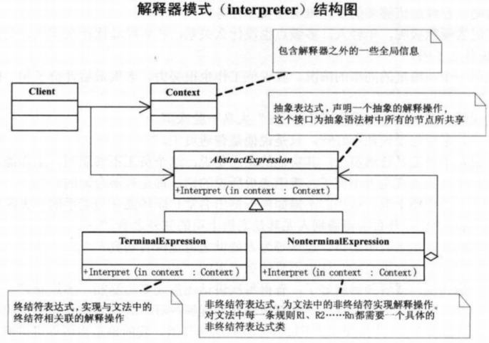

#策略模式
定义：它定义了算法家族，分别封装起来，让它们之间可以项目替换，此模式让算法的变化，不会影响到使用算法的客户。
策略模式是一种定义一系列算法的方法，从概念上来看，所有这些算法完成的都是相同的工作，只是实现不同，它可以以相同的方式调用所有的算法，减少了各种算法类与使用算法类之间的耦合。
策略模式的Strategy类层次为Context定义了一系列的可供重用的算法或行为。继承有助于析取出这些算法中的公共功能。

#装饰模式
定义：动态地给一个对象添加一些额外的职责，就增加功能来说，装饰模式比生成子类更为灵活。
它是为已有功能动态地添加更多功能的一种方式。当系统需要新功能的时候，是向旧的类中添加新的代码。这些新加的代码通常装饰了原有类的核心职责或主要行为。把类中的装饰功能从类中搬移去除，这样可以简化原有的类。
有效的把类的核心职责和装饰功能分开了，而且可以去除相关类中重复的装饰逻辑。

#代理模式
定义：为其他对象提供一种代理以控制对这个对象的访问。
使用场景：
1. 远程代理，为一个对象在不同的地址空间提供局部代表。这样可以隐藏一个对象存在于不同地址空间的事实。
2. 虚拟代理，是根据需要创建开销很大的对象。通过它来存放实例化需要很长时间的真实对象。
3. 安全代理，用来控制真实对象访问时的权限。
4. 智能指引，是指当调用真实的对象时，代理处理另外一些事。

#工厂方法模式
定义：定义一个用于创建对象的接口，让子类决定实例化哪一个类。工厂方法使一个类的实例化延迟到其子类。

#原型模式
定义：用原型实例指定创建对象的种类，并且通过拷贝这些原型创建新的对象。
原型模式其实就是从一个对象再创建另外一个可定制的对象，而且不需知道任何创建的细节。一般在初始化的信息不发生变化的情况下，克隆是最好的方法，即隐藏了对象创建的细节，又对性能是有提高，不需要每次去执行一次构造函数。

#模板方法模式
定义：定义一个操作中的算法的骨架，而将一些步骤延迟到子类中。模板方法使得子类可以不改变一个算法的结构即可重定义该算法的某些特定步骤。
当不变的和可变的行为在方法的子类实现中混合在一起的时候，不变的行为就会在子类中重复出现，通过模板方法模式把这些行为搬移到单一的地方，这样就帮助之类摆脱重复的不变行为的纠缠。

#外观模式
定义：为子系统中的一组接口提供一个一致的界面，此模式定义了一个高层接口，这个接口使得这一子系统更加容易使用。
使用场景：
1. 在设计初期阶段，应该有意识的将不同的两个层分离，层与层之间建立外观，降低耦合性。
2. 在开发阶段，子系统往往因为不断的重构演化而变得越来越复杂，会产生很多小的类，增加一个外观，可以减少它们之间的依赖。
3. 在维护一个遗留的大型系统时，可能这个系统已经非常难以维护和扩展了，可以为新系统开发一个外观，来提供设计粗糙或高度复杂的遗留代码的比较清晰的简单的接口，让新系统与外观对象交互，外观对象与遗留代码交互所有复杂的工作。

#建造者模式
定义：将一个复杂对象的构建与它的表示分离，使得同样的构建过程可以创建不同的表示。
使用场景：用于创建一些复杂的对象，这些对象内部构建间的建造顺序通常是稳定的，但对象内部的构建通常面临着复杂的变化。使得建造代码与表示代码分离，由于建造者隐藏了该产品是如何组装的，所以若需要改变一个产品的内部表示，只需要在定义一个具体的建造者就可以了。
建造者模式是在当创建复杂对象的算法应该独立于该对象的组成部分以及它们的装配方式时使用的模式。

#观察者模式（发布-订阅模式）
定义：定义了一种一对多的依赖关系，让多个观察者对象同时监听某一个主题对象。这个主题对象在状态发生变化时，会通知所有观察者对象，使它们能够自动更新自己。
使用场景：当一个对象的改变需要同时改变其他对象，而且它不知道具体有多少对象有待改变时。

#抽象工厂模式
定义：提供一个创建一系列相关或相互依赖对象的接口，而无需指定它们具体的类。
所有用在简单工厂的地方，都可以考虑用反射技术来去除switch或if，解除分支判断带来的耦合。

#状态模式
定义：当一个对象的内在状态改变时允许改变其行为，这个对象看起来像是改变了其类。
它主要解决的时当一个对象状态转化的条件表达式过于复杂时的情况，把状态的判断逻辑转移到表示不同状态的一系列类当中，可以把复杂的判断逻辑简化。
将与特定状态相关的行为局部化，并且将不同状态的行为分割开来。
使用场景：当一个对象的行为取决于它的状态，并且它必须在运行时刻根据状态改变它的行为时，就可以考虑使用状态模式。

#适配器模式（Adapter）
定义：将一个类的接口转换成客户端希望的另外一个接口。Adapter模式使得原本由于接口不兼容而不能一起工作的那些类可以一起工作。
主要应用于希望复用一些现存的类，但是接口又与复用环境要求不一致的情况。有两种类型：1.类适配器模式 2. 对象适配器模式
使用场景：在想使用一个已经存在的类，但如果它的接口，也就是它的方法和你的要求不同时，就应该考虑用适配器模式。两个类所做的事情相同或相似，但是具有不同的接口时要使用它。
   

#备忘录模式
定义：在不破坏封装性的前提下，捕获一个对象的内部状态，并在该对象之外保存这个状态。这样以后就可将该对象恢复到原先保存的状态。

#组合模式
定义：将对象组合成树形结构以表示‘部分-整体’的层次结构。组合模式使得用户对单个对象和组合对象的使用具有一致性。
使用场景：需求中是体现部分与整体层次的结构时，以及希望用户可以忽略组合对象与单个对象的不同，统一地使用组合结构中地所有对象时，就应该考虑用组合模式了。

#迭代器模式
定义：提供一种方法顺序访问一个聚合对象中地各个元素，而又不暴露该对象的内部表示

#单例模式
定义：确保一个类只有一个实例，并提供一个全局访问点来获取这个实例。

#桥接模式
定义：将抽象部分与它的实现部分分离，使它们都可以独立地变化。

#命令模式
定义：将一个请求封装为一个对象，从而使你可用不同的请求对客户进行参数化；对请求排队或记录请求日志，以及支持可撤销的操作。

#责任链模式
定义：使多个对象都有机会处理请求，从而避免请求的发送者和接收者之间的耦合关系。将这个对象连成一条链，并沿着这条链传递该请求，直到有一个对象处理它为止。

#中介者模式
定义：用一个中介对象来封装一系列的对象交互。中介者使各对象不需要显式地相互作用，从而使其耦合松散，而且可以独立地改变它们之间的交互。

#亨元模式
定义：运用共享技术有效地支持大量细粒度的对象。
使用场景：可以避免大量非常相似类的开销。在程序设计中，有时需要生成大量细粒度的类实例来表示数据。如果能发现这些实例除了几个参数外基本上都是相同的，有时就能够大幅度地减少需要实例化的类的数量。如果能把那些参数移到类实例的外面，在方法调用时将它们传递进来，就可以通过共享大幅度地减少单个实例的数目。
当一个应用程序使用了大量的对象，而大量的这些对象造成了很大的存储开销时就应该考虑使用；还有就是对象的大多数状态可以外部状态，如果删除对象的外部状态，那么可以用相对较少的共享对象取代很多组对象，此时可以考虑使用此模式。

#解释器模式
定义：定义一个语言，定义它的文法的一种表示，并定义一个解释器，这个解释器使用该表示来解释语言中的句子。
使用场景：当有一个语言需要解释执行，并且你可将语言中的句子表示为一个抽象语法树时，可使用此模式。

#访问者模式
定义：表示一个作用于某对象结构中的各元素的操作。它使你可以在不改变各元素的类的前提下定义作用于这些元素的新操作。
使用场景：把处理从数据结构分离出来。

