## 命名风格
因为产品有时会有破环性的需求出现，导致根据之前业务实现的代码无法重构，这种场景一般我会保留原有的代码文件，然后新建代码文件，保留旧文件用于回滚，同时命名+数字来区分。  
所以看到同样类名但是数字不同的时候，一般就是因为有破坏性的需求。
``` c#
//  如视频服务实现了三个类
public class VideoService : IVideoService{} // 从后端获取视频启、停、心跳 api，通过后端接口进行云台控制

public class VideoService2 : VideoService{} // 从后端获取视频启、停、心跳 api，通过 uniview 进行云台控制

public class VideoService3 : VideoService2{} // 通过 onvif 进行视频启停、通过 uniview 进行云台控制

// 如晚间助手实现了两个类
public class EveningHelperViewModel{} // 根据产品需求开发的第一版

public class EveningHelper2ViewModel{} // 产品引入破环性需求，开发了第二版
```

---
## 视频业务
视频业务由三个部分组成：视频服务、视频控件、视频配置。
### 视频服务
视频服务核心接口是播放接口、心跳接口。  
``` C#
public interface IVideoService
{
    Task<List<PlayVideoResponse>> PlayVideo(params long[] cameraId); // 播放接口
    void KeepAlive(string session); // 心跳接口
}
```
设计逻辑是
1. 视频控件调用 `PlayVideo(long[])` 返回 RTSP URL 和 SessionId，然后视频控件是用 URL 进行播放视频，并且再播放期间 5s 间隔轮询调用 `KeepAlive(string)` 来保活。
2. 视频服务实现类会维护 SessionId 集合，并且 10s 间隔对活跃的 session 调用后端接口进行保活，对不活跃的 session 调用后端接口进行停止播放。  
   
### 视频服务实现类：
1. `Hjmos.Ncc.TempService.Media.VideoService`
   - 功能：通过调用 MediaAgent 的 http 接口进行视频的注册、播放、停止、心跳、云台控制，调用 uniview SDK 实现了预置位功能。
   - MediaAgent 文档：`./doc/GZL18-ISCS项目MediaAgent系统接口设计说明书.docx`
   - 实现逻辑封装在 `Hjmos.Ncc.TempService.Media.Iscs*.cs` 中
        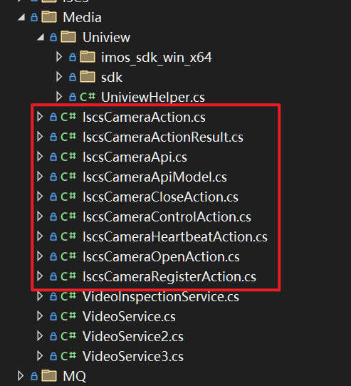
   - 注意点  
        1. 需要在客户端配置选中 MediaAgent，保存并重启客户端才能生效。  
   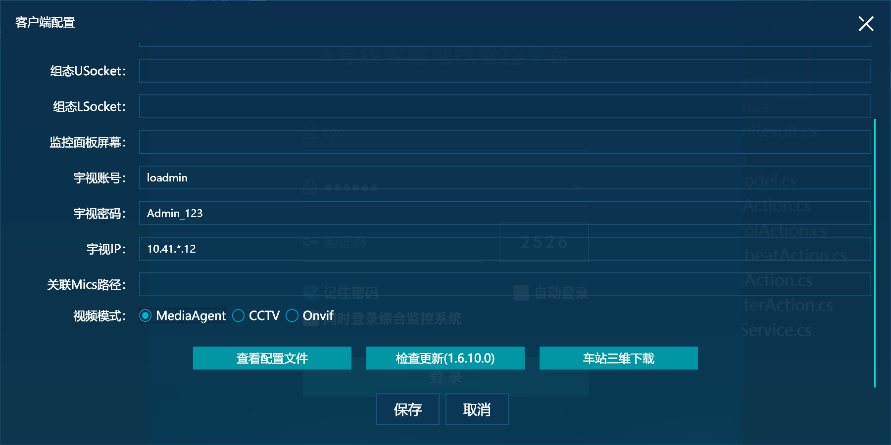
        2. MediaAgent 的 play 接口是串行处理，处理时间大概是 2s，如果并发调用不同摄像头，接口会堆积，返回会越来越慢。如果是相同摄像头，因为有缓存，所以会秒回。
        3. MediaAgent 有的摄像头会无法播放，可以看接口日志，一般是超时或者接口异常。
2. `Hjmos.Ncc.TempService.Media.VideoService2`
   - 功能：通过调用后端接口，直接返回摄像头的 RTSP 链接，调用 uniview SDK 实现了云台控制、预置位功能。
   - Uniview SDK、文档、Demo 程序下载地址：  [官网地址](https://cn.uniview.com/Service/Service_Training/Download/SDK/Home/Player/201603/796462_194214_0.htm)
   - 实现逻辑封装在 `Hjmos.Ncc.TempService.Media.Uniview` 下的类中
  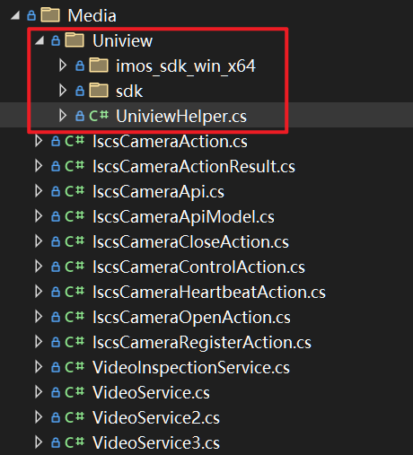
   - 注意点
      1. 需要在客户端配置选中 CCTV，保存并重启客户端才能生效。
      2. 需要在客户端配置中配置宇视账号、密码、IP。账号是 loadmin，密码是 Admin_123，IP 的规则是 10.41.*.12，谢家桥是1，机场是34，以此类推。
   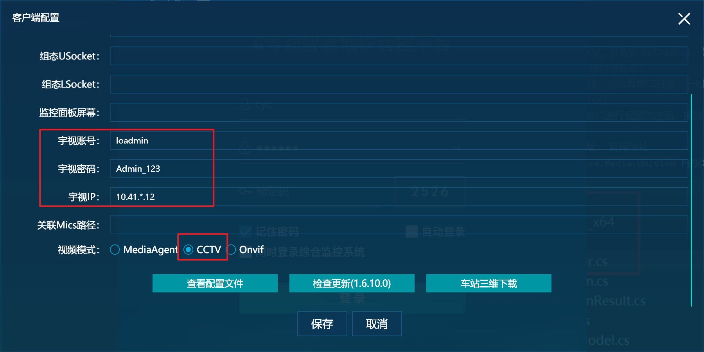
      3. 宇视的摄像头网络只能车站联通，跟车辆段不同，所以在车辆段无法使用此功能。
3. `Hjmos.Ncc.TempService.Media.VideoService3`
   - 功能：通过 Onvif 协议实现获取摄像头 RTSP 链接，调用 uniview SDK 实现了云台控制、预置位功能。
   - 实现 Onvif 是为了解决车站全景摄像头无法播放的问题，现在车站应该都是是用 Onvif 进行拉流的。
   - Onvif 简介：Onvif 是一个安防行业标准协议，摄像头就是其中一个模块。通过 WebService 的形式引入程序，按文档开发。文档地址：[Onvif 文档](https://www.onvif.org/ch/profiles/specifications/)
   - 逻辑全部封装在 `Hjmos.Ncc.TempService.Media.VideoService3` 中。
   - 注意点： 
        1. 需要在客户端配置选中 Onvif，保存并重启客户端才能生效。
        2. 只能在车站使用，不能在车辆段使用。
        3. Onvif 功能强大，覆盖了摄像头所有功能，需要测试可以在公司环境下使用智慧城市的摄像头进行测试。
### 视频控件
1. `Hjmos.Ncc.Cctv.Views.ResourceCategory.VideoPlayer2`
   - 功能：通过 vlc 参数实现循环播放，用于应急联动场景。vlc 有大量参数，可以 google 或者查看维基百科的详细介绍。
2. `Hjmos.Ncc.Cctv.Views.ResourceCategory.VideoPlayerView`
   - 功能：客户端摄像头拉流控件，基于 VLC，封装了 `Loaded` 和 `Unloaded` 实现切换界面自动启停。封装了播放、停止、暂停、重播的方法。封装了云台、全屏等交互功能。
   - 实现：因为视频控件有很多事件操作，在设计之初为了聚合逻辑，使用了反应式编程，使用了 Reactive.Net 这个库。反应式编程适合聚合异步和多个事件操作，具有很高的封装度、流式编程语法，所以可以分散在多个方法中的命令式代码聚合到一个反应链中，实现优雅，但是中文基本没资料。需要了解可以看官网介绍 [ReactiveX](https://reactivex.io/)，以及电子书一本`./doc/Rx.NET in Action-2017-英文版.pdf`。
   - `VideoPlayerView.PlayForId(long)`：传入 ID 播放视频。
   - `VideoPlayerView.Stop()`：停止播放。
   - 注意点：
        1. VLC 的停止播放会调用 `WaitHandle`，所以是会阻塞线程，我实现的时候直接把操作推送到线程池中，当线程池中的后台现场全部被阻塞之后，就会使用 UI 线程来播放视频了，如果发生这种情况，应该从摄像头为什么会阻塞线程入手调试，不应该从如何不在 UI 线程上入手调试，因为 VLC 正常情况下，无法播放是否成功，都会释放线程的。
        2. 反应式编程上手难，资料少，如果后续视频控件产品还有需求，建议拒绝，或者花一个月时间重开或者熟悉反应式编程。
        3. VLC 被 ViewBox 包装时，不会自动缩放，但是可以通过修改源码解决，我在实现大屏客户端的时候已经解决这个问题，如果后续有被 ViewBox 包装的需求，可以看大屏的仓库代码。
        4. VLC 是使用 GUI 技术进行渲染的，跟 WPF 渲染机制不同，所以也会有空域问题。
3. `Hjmos.Ncc.Cctv.Views.ResourceCategory.GeneralResourceCategoryView` 和 `Hjmos.Ncc.Cctv.ViewModels.ResourceCategory.GeneralResourceCategoryViewModel`
   - `GeneralResourceCategoryViewModel` 是根据产品的需求，抽象出了常见场景的左边视频树，右边视频窗口的功能，并且提供了数个构造函数重载实现了四宫格、九宫格等功能。
   - 使用样例代码可以看 `Hjmos.Ncc.Cctv.Views.ResourceCategory.VideoInCarView` 车载视频、`Hjmos.Ncc.EmergencyCommandV1.Views.LineFloodPrevention.FloodPreventionMonitoringFloodVideoView` 防汛视频等。
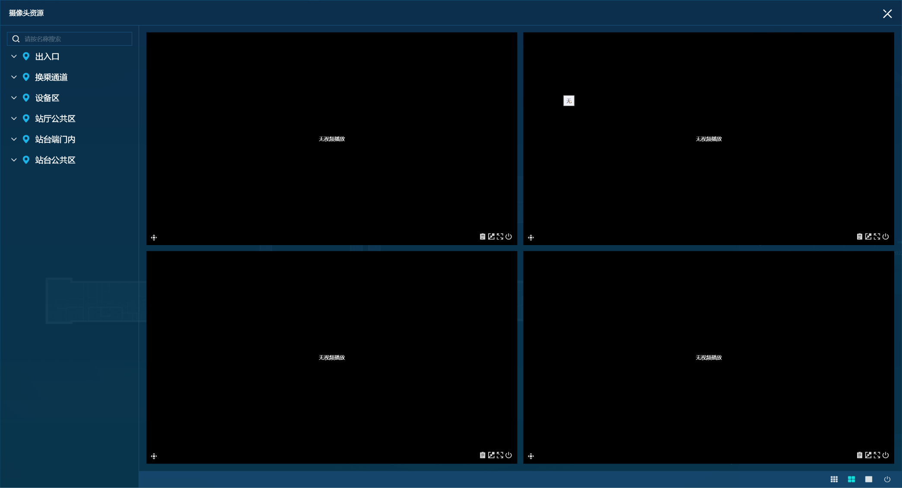
### 视频配置
通过切换容器是视频服务实现不同视频实现。具体代码在：`Hjmos.Ncc.WS.App.RegisterRealService(IContainerRegistry)`
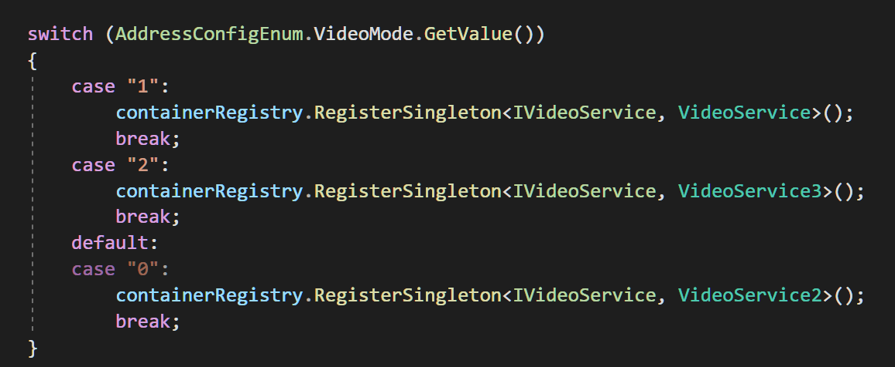

--- 
## 自动更新业务
自动更新业务由编译脚本、客户端检测更新、自动部署工具组成。
### 编译脚本
在 Jenkins 根据 tag 拉取代码后，会调用 build(Release).bat 进行编译。我在编译客户端过程中，编译了加密程序和版本号生成工具，最终使用版本号生产工具生成版本文件，然后打包发布到 svn。
- 编译加密程序和版本号生成工具
  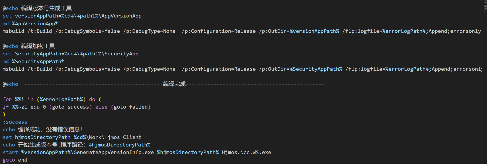
- 调用版本号生成工具生成版本文件
  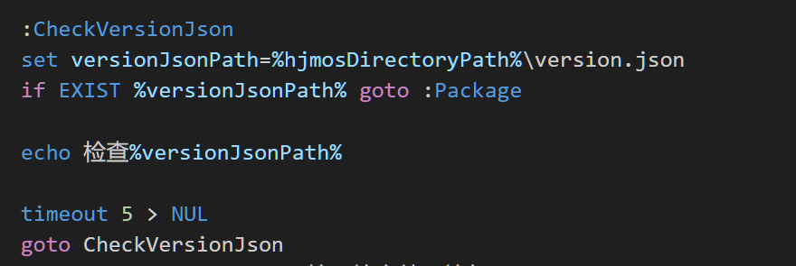
- 生成的版本文件，version.json  
  `Files` ：表示 dll 的详细信息，`Length` 和 `Size` 表示整个包的大小，`Description` 表示版本描述，`Version` 表示版本号。
  ``` json
  {
    "Files": [{
        "FileName": "Config\\Hjmos_Ncc.config",
        "Md5": "043yoRVq2WV13ygc4xHGNw==",
        "Length": 6674
    }, {
        "FileName": "Config\\Modules.config",
        "Md5": "rvhqZZxN/pU5bgrvCwBlEQ==",
        "Length": 1141
    }],
    "Length": 948263017,
    "Size": "904Mb",
    "Description": "1.6.8.4beta",
    "Version": "1.6.8.4"
    }
  ```
  - 注意点：
    1. 不同机器编译的 dll MD5 是不一样的，所以要注意，编辑机应该一直是同一台虚拟机才能增量更新，否则就是全量更新了。
### 客户端检测更新代码
- 功能：
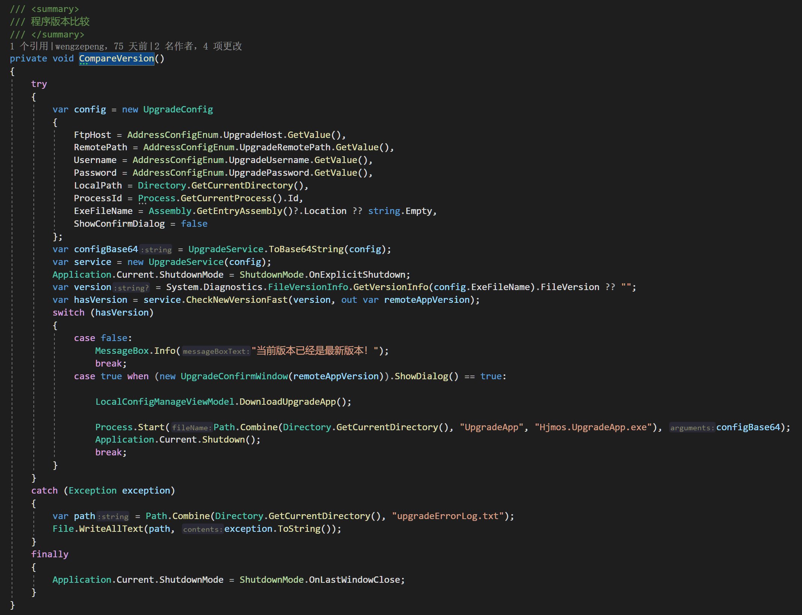
- 逻辑：先下载 UpgradeApp/Hjmos.UpgradeApp.exe，然后调用 exe 进行检测更新。
- 注意点：
    1. 如果更新工具跟客户端有共用 dll，会有冲突问题，已经通过更新工具独立文件夹来解决这个问题，如果后续有新的更新功能开发，需要注意这一点。
    2. 有时现场会更新失败，一般都是因为 ftp 地址填错导致，可以看日志，更新失败会有 upgradeErrorLog.txt 日志，如果里面是个 Socket 超时异常，就是连不上 ftp 导致的。
### 自动部署工具
- 逻辑
    1. 拉取 svn 的包文件，根据包文件格式拆包，筛选能部署的文件。
   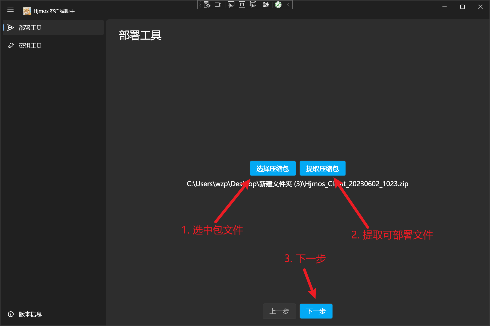
    2. 修改文件配置成目标环境的配置。
   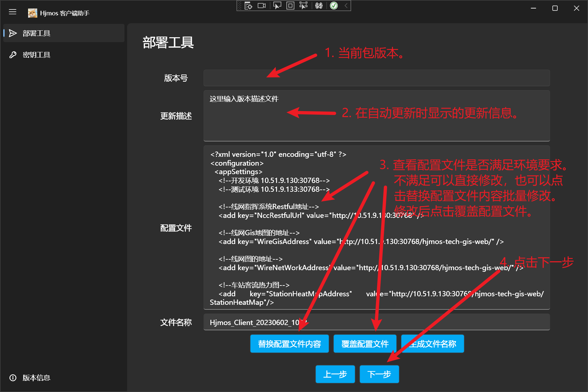
    3. 配置目标服务器 IP、UserName、Password，生成部署包，链接并运行 shell 脚本上传部署包。
    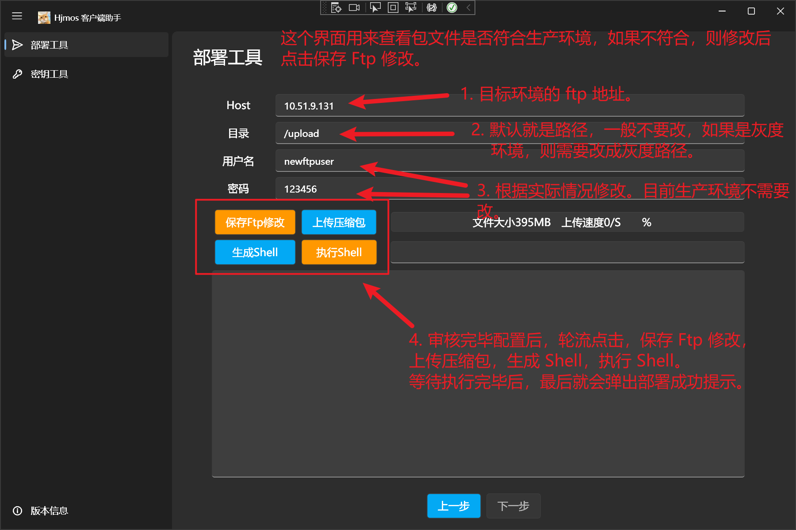

- 部署工具提供了一个加密解密工具，用于加密解密敏感信息，如服务器的IP、UserName、Password。
  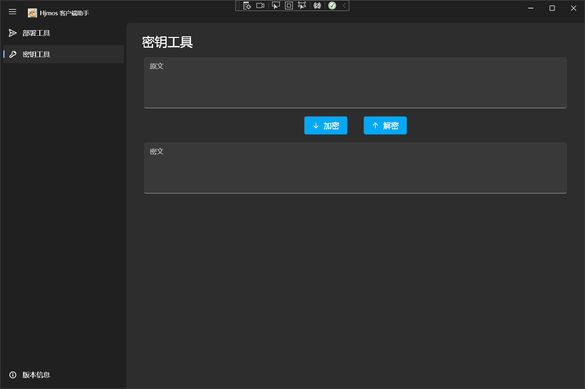

- 代码仓库  
    需要魔改时可用。
  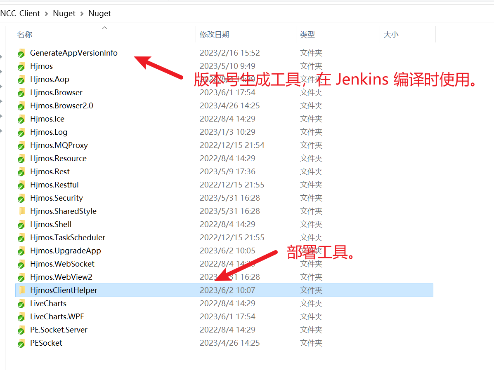

## 已开发但未上线、未测试、未满足功能
### 智能照明
- 分支： origin/IntelligentLighting
- 界面功能已经全部开发好了，接口也调过了。但是群控照明设备、点控照明设备、自定义模式生产均没有点位。所以目前只上线了切换内置模式的功能。
### 晚间助手 2.0
- 分支：origin/eveningHelper
- 界面功能已经开发完了，测试中。